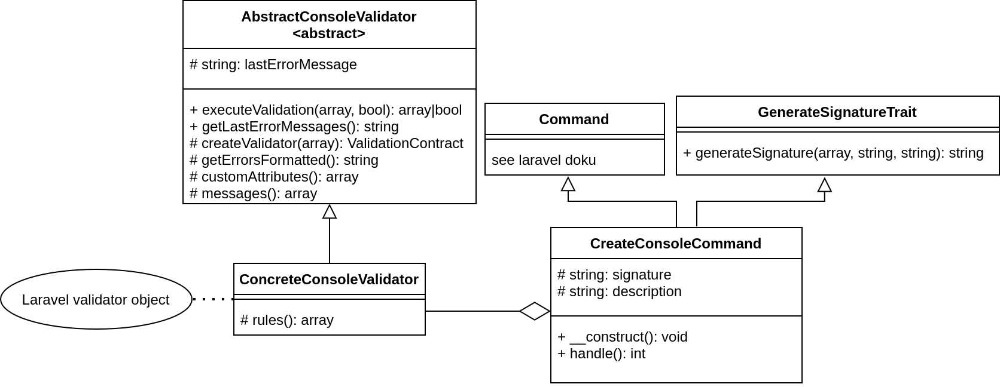

<!-- PROJECT LOGO -->
<br />
<p align="center">
  <a href="https://github.com/github_username/repo_name">
    
  </a>

<h2 align="center">Laravel Command Line Validation </h2>

<p align="center">
    This is a package to validate your custom laravel artisan commands.
</p>

<!-- TABLE OF CONTENTS -->
<details open="open">
  <summary><h2 style="display: inline-block">Table of Contents</h2></summary>
  <ol>
    <li>
      <a href="#about-the-project">About The Project</a>
      <ul>
        <li><a href="#built-with">Built With</a></li>
      </ul>
    </li>
    <li>
      <a href="#getting-started">Getting Started</a>
      <ul>
        <li><a href="#installation">Installation</a></li>
        <li><a href="#artisan-console-class">Artisan Console Class</a></li>
      </ul>
    </li>
    <li><a href="#UML-class-diagrams">UML Class Diagrams</a></li>
    <li><a href="#how-to-validate">How to validate</a></li>
    <li><a href="#example-validation">Example Validation</a></li>
    <li><a href="#generate-signatures-automatically">Generate Signatures Automatically</a></li>
    <li><a href="#acvices">Advices</a></li>
    <li><a href="#contributing">Contributing</a></li>
    <li><a href="#license">License</a></li>
    <li><a href="#credits">Credits</a></li>
  </ol>
</details>


<!-- ABOUT THE PROJECT -->

## About The Project

This is a package to validate your custom laravel commands. We tried to integrate the project as well as possible into
the laravel ecosystem. So that you can use the same rule logic for your validation as with the normal validation forms.

In laravel you can easily validate user data in forms. But there wasn't a standard solution if you want to validate
something in the command line without requests. We want change that and want to offer a simple solution with this
package for the command line validation process.

### Built With

* [PHP 7.3]()
* [Laravel 8]()

<!-- GETTING STARTED -->

## Getting Started

To get a local copy up and running, follow these simple steps.

### Installation

1. Go to your project folder in your favorite command line interface

2. Install the Composer package
   ```sh
   composer require wtl/laravelCommandLineValidation
   ```

### Artisan Console Class

This package is based on the Laravel Artisan Console. You can create this laravel class with the following command:

```sh   
php artisan make:command YourArtisanCommand
```

and run it with this command

```sh   
php artisan YourArtisanCommand
```

for more have a look at the documentation https://laravel.com/docs/8.x/artisan


<!-- CLASS DIAGRAM -->

## UML Class Diagrams

### Overview over the package:


This package provides 2 classes: AbstractConsoleValidator and GenerateSignatureTrait

You have to create 2 classes: YourArtisanCommand (explained above) and ConcreteConsoleValidator

### More accurate class diagram:



## How to validate

1. Create a class ConcreteConsoleValidator that extends AbstractConsoleValidator
1. Define the abstract method 'rules()' with your own rules and return an array (just like with form requests).
   https://laravel.com/docs/8.x/validation#creating-form-requests
1. Inject the class 'ConcreteConsoleValidator' into your handle() method in the class YourArtisanCommand
   ```sh   
    public function handle(ConcreteConsoleValidator $concreteConsoleValidator): int {}
    ```
1. Use the ConcreteConsoleValidator's method 'executeValidation(bool, array): bool' in your handle() method to validate
   your data.
    1. Set the arguments
        1. bool $throwException: <br /><br />
           false: The method returns true if the validation was correct and false if it was incorrect. <br />
           true: The method returns true if the validation was correct and throws a ValidationException if it was
           incorrect.
           <br /><br />
           (If you want it to be the same as with Form request, use true.)
        1. array $optionsCommandLineUserInput: <br /><br />
           Define your command line input expectations in the signature attribute and call these formatted in an array
           for example with this method:
           https://laravel.com/docs/8.x/artisan#options
           ```sh   
           $this->options()
           ```

    1. If the validation fails, the validation error messages will get saved as string and can be returned with the
       ConcreteConsoleValidator's method 'getLastErrorMessages()'.

## Example validation

```sh   
public function handle(ConcreteValidator $concreteValidator): int
{
    if ($concreteValidator->executeValidation($this->options(), false)) {

        //validation correct. Do something with the validated data. (here: $this->options())

        $this->info('The validation was correct. The command was successful.');
    } else {
        $this->error($concreteValidator->getLastErrorMessages());
    }
    return 0;
}
```

## Generate signatures automatically

Usually you have to declare the input expectations manually in the signature attribute of your YourArtisanCommand class.
With this package you can create the signature automatically with the help of the trait 'GenerateSignatureTrait'.

The trait generates the signature from the method 'rules()' of your class 'ConcreteConsoleValidator'. The trait method
creates for each rule one input expectation in form of an option.

So you have to create a rule for every input expectation that you want to validate in order to use the trait.

### How to generate your signature

1. Use the trait in the class YourArtisanCommand
   ```sh   
   class YourArtisanCommand extends Command {
    use GenerateSignatureTrait;
   ```
1. Set the new signature in the constructor with the trait's method generateSignature(array, string, string). <br/>
   The method requires your rules and a command name as parameters.
   ```sh   
   public function __construct(ConcreteConsoleValidator $concreteConsoleValidator)
    {
        $this->signature = $this->generateSignature($concreteConsoleValidator->rules(), 'commandName');
        parent::__construct();
    }
   ```
   The parent constructor needs the signature therefore you have to declare the signature beforehand.

(3.) The third argument of the method is optional. You can use it if you want to set input expectations which should not
be validated. Write your expectations in the string as if you were writing it in the signature attribute. <br />
https://laravel.com/docs/8.x/artisan#defining-input-expectations
<br/> <br/>
For example you could use it as boolean switch for the the ConcreteConsoleValidator's method 'executeValidation(bool,
array): bool'

   ```sh   
   $this->signature = $this->generateSignatureWithShortcuts($userRequestRules->rules(), $this->commandName, '{--x|reportException}');
   ```

and in the handle method of your YourArtisanCommand class like this:

   ```sh
   $userInputArray = $this->options();
   $userRequestRules->executeValidation($userInputArray['reportException'], $this->options())
   ```

With this switch you can now decide in the command line whether you want to throw an exception or not.

   ```sh
   php artisan commandName --email test@mail.com --age 25 -x
   ```

## Advices

1. This command displays how you can use your command. It displays the command description and which input options are
   available.
   ```sh 
   php artisan YourArtisanCommandName --help
   ```

1. If you have already defined rules for your form request, you can synchronize both rules() methods (form request &
   concreteConsoleValidator) with another trait.

<!-- CONTRIBUTING -->

## Contributing

Contributions make the open source community to such an amazing place to learn, inspire, and create. Any contributions
you make are **greatly appreciated**.

1. Fork the project
1. Create your feature branch (`git checkout -b feature/AmazingFeature`)
1. Code an amazing feature with tests
1. Commit your changes (`git commit -m 'Add some AmazingFeature'`)
1. Push to the branch (`git push origin feature/AmazingFeature`)
1. Open a pull request

<!-- LICENSE -->

## License

Distributed under the MIT License. See `LICENSE` for more information.


<!-- ACKNOWLEDGEMENTS -->

## Credits

* [nice Readme](https://github.com/othneildrew/Best-README-Template/blob/master/BLANK_README.md)
* []()
* []()

